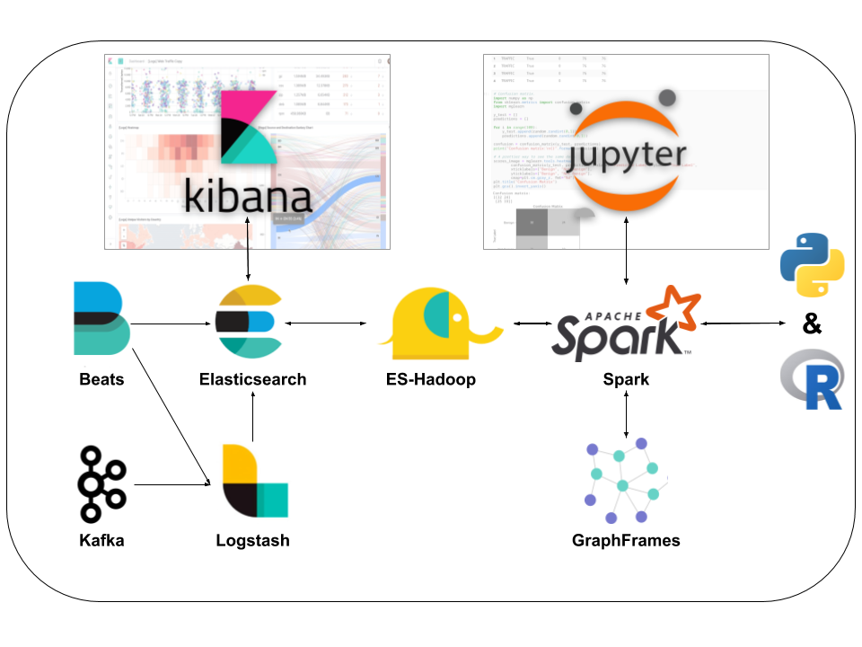

# RELK
The Research Elastic Stack Package

## Goal
To design an Elastic stack that includes Spark out of the box for in-depth data analysis and computation. 

## Features
* **Kafka**: A distributed publish-subscribe messaging system that is designed to be fast, scalable, fault-tolerant, and durable.
* **Elasticsearch**: A highly scalable open-source full-text search and analytics engine.
* **Logstash**: A data collection engine with real-time pipelining capabilities.
* **Kibana**: An open source analytics and visualization platform designed to work with Elasticsearch.
* **ES-Hadoop**: An open-source, stand-alone, self-contained, small library that allows Hadoop jobs (whether using Map/Reduce or libraries built upon it such as Hive, Pig or Cascading or new upcoming libraries like Apache Spark ) to interact with Elasticsearch.
* **Spark**: A fast and general-purpose cluster computing system. It provides high-level APIs in Java, Scala, Python and R, and an optimized engine that supports general execution graphs.
* **GraphFrames**: A package for Apache Spark which provides DataFrame-based Graphs.
* **Jupyter Notebook**: An open-source web application that allows you to create and share documents that contain live code, equations, visualizations and narrative text.

## Preparation
The only major modifications needed are:
1. Remove and replace the elasticsearch index templates
    * Found in RELK/elasticsearch/output_templates

2. Remove and replace the logstash conf files
    * Found in RELK/logstash/pipelines

## Running
1. Easy! `docker-compose up`

If you'd like to have the comtainers running in the background:
`docker-compose up -d`

## Other Notes
* Kafka uses port 9092
* Kibana uses 9601
* Jupyter uses 8888
* By default, Jupyter notebooks password is 'research'. This can be changed in the docker-compose file

## TODO
* Password protect ES/Kibana
